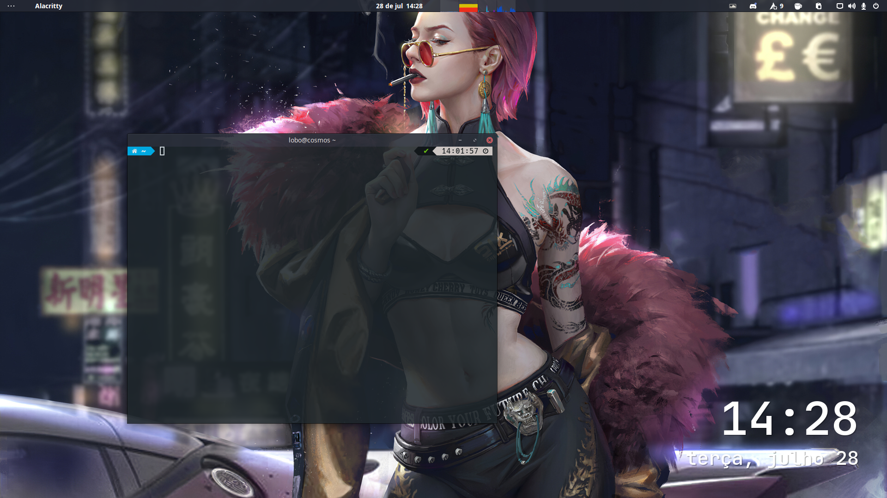
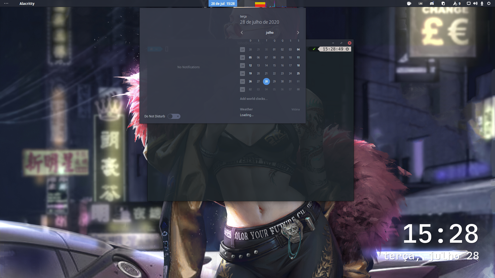
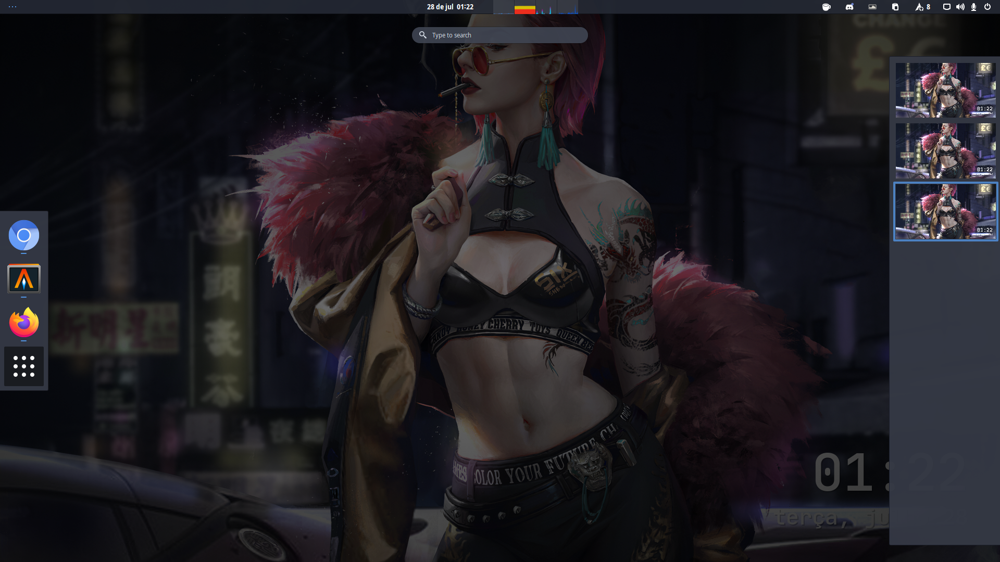
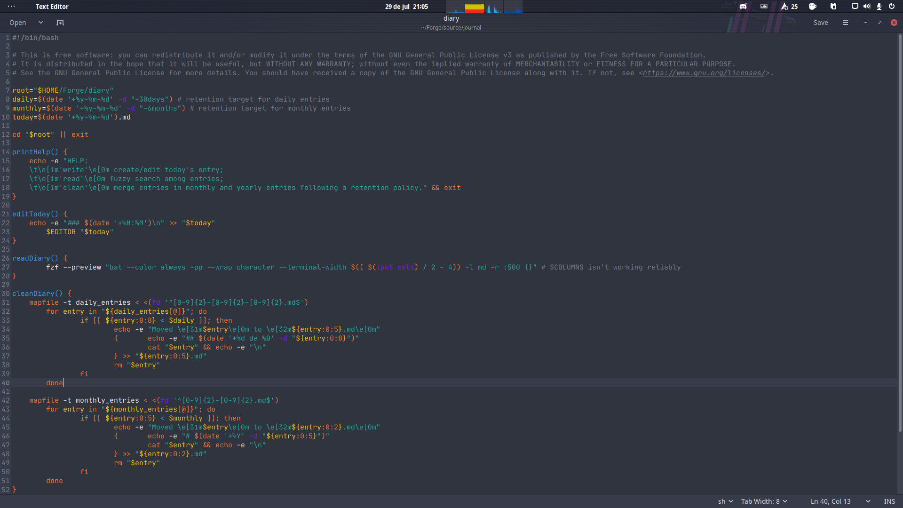
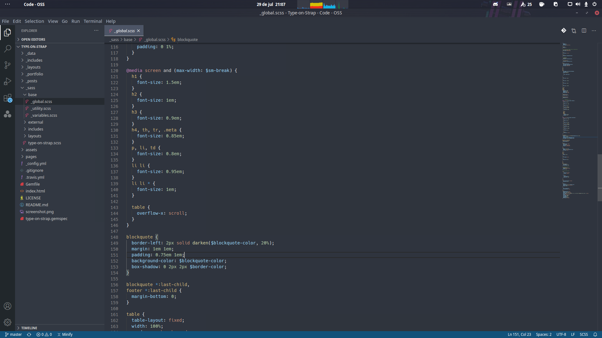
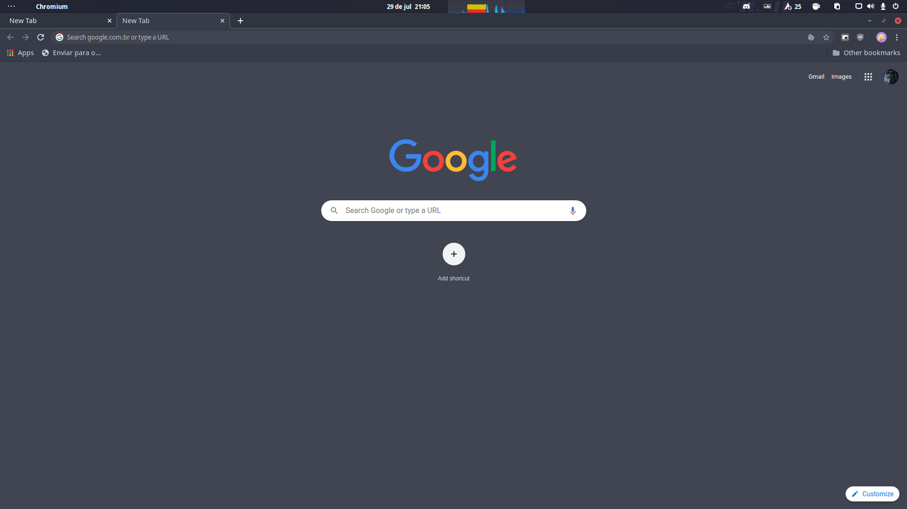
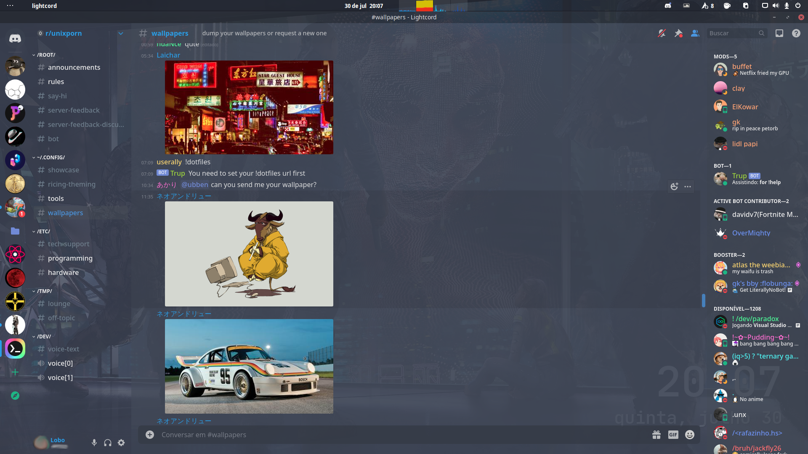

<!-- TOC GitLab -->

- [Changes from upstream](#changes-from-upstream)
- [How it looks](#how-it-looks)
- [Extras](#extras)
- [Contributing](#contributing)

<!-- /TOC -->

This is a fork of [jnsh/arc-theme](https://github.com/jnsh/arc-theme), that by itself is a fork of the original and not mantained [horst3180/arc-theme](ihttps://github.com/horst3180/arc-theme).

Arc Neon is a Gnome Shell flat theme with transparent elements and support for popular applications.

## Changes from upstream

+ Improved top bar 
+ Opaque elements made subtle transparent 
+ Improved chromium theme
+ Gedit theme
+ VS Code theme
+ Discord theme

## How it looks

## Extras

Complementary themes for popular applications.

I recommned these.

Icons: papi-dark
Cursors: capitaine

## Contributing
Check what I'm planning and how to contribute in [Development](DEVELOPMENT.md). Feel free to open an issue if you have questions or ideas to share. 

